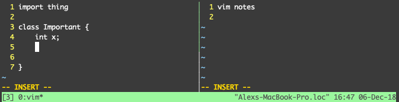

# Tmux Sidenote

Tmux-sidenote is a plugin for tmux which, when the user hits `Prefix + N`, will create a new pane and open a relevant note using vim in the pane.

It's built using [tmux sidelib](https://www.github.com/alexsaalberg/tmux-sidelib), a shell script library which can be used to easily create plugins in the same ilk.

### Example

If you are editing something in vim, and then hit `Prefix + N`, a new pane will open and then the command `vim ~/.note/vim.note` will be run in it.

The tmux session will then look like this.

## How to use

1. Hit the key binding (`Prefix + N`) to open up a note pane in a new pane next to the current one.

2. When you hit the key binding (`Prefix + N`) again, one of two things could happen.

   - If you're in the same program, the note will be saved and the sidepane will be closed.
   
   - If you're in a different program, the note will be saved and a new note will be opened.
   
## How to install

### Installation with [Tmux Plugin Manager](https://github.com/tmux-plugins/tpm) (recommended)

Add plugin to the list of TPM plugins in `.tmux.conf`:

    set -g @plugin 'alexsaalberg/tmux-sidenote'

Hit `prefix + I` to fetch the plugin and source it. You should now be able to
use the plugin.

### Manual Installation

Clone the repo:

    $ git clone https://github.com/alexsaalberg/tmux-sidenote ~/clone/path

Add this line to the bottom of `.tmux.conf`:

    run-shell ~/clone/path/tmux_sidelib.tmux

Reload TMUX environment:

    # type this in terminal
    $ tmux source-file ~/.tmux.conf

You should now be able to use the plugin.

## Requirements

- `tmux 1.8` or higher

## Changes

**v1.0**

- Initial release.

- Built on [tmux-sidelib](https://www.github.com/alexsaalberg/tmux-sidelib) version v0.2

- Timeout functionality currently disabled.

## Other Stuff

- [tmux-sidelib](https://www.github.com/alexsaalberg/tmux-sidelib)

- [tmux plugin manager](https://github.com/tmux-plugins/tpm)

- [tmux-sidebar](https://www.github.com/tmux-plugins/tmux-sidebar) 
    - Inspiration for tmux-notepane, tmux-sidelib, etc.
    
- [tmux-notepane](https://www.github.com/tmux-plugins/tmux-notepane) 
  - Similar thing, but built using python and [libtmux](https://github.com/tmux-python/libtmux)

